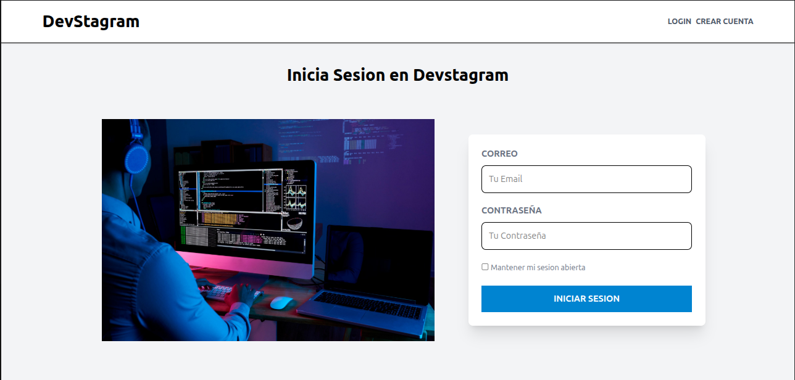
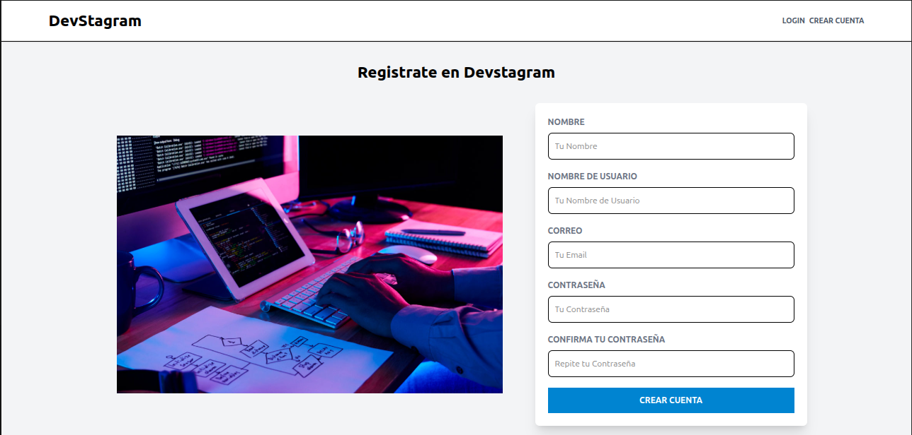
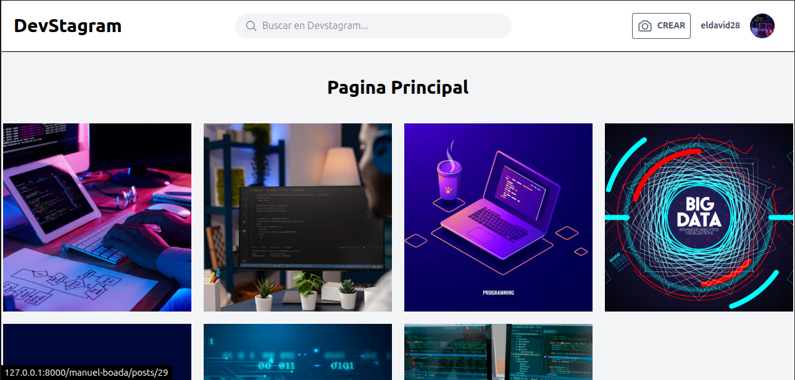
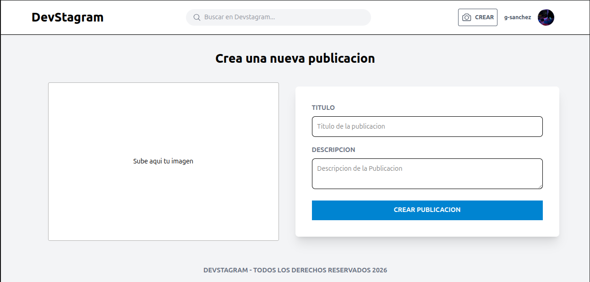
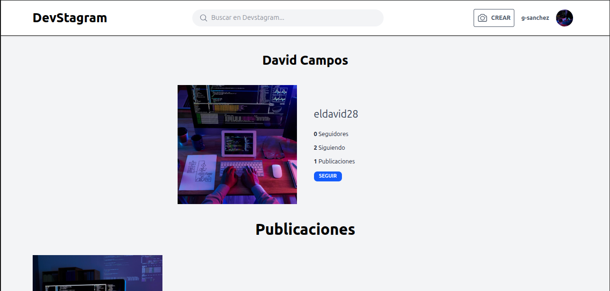
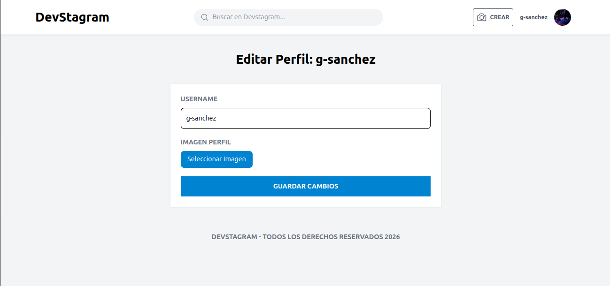

# Devstagram

Plataforma social tipo Instagram construida con Laravel 12, Livewire 3 y Tailwind CSS.

<h2 align="center">User Views</h2>

<table align="center">
  <tr>
    <td></td>
    <td></td>
    <td></td>
  </tr>
  <tr>
    <td></td>
    <td></td>
    <td></td>
  </tr>
    <td></td>
</table>

## Requisitos

- PHP 8.2+
- Composer
- Node.js y npm
- MySQL (o Docker con Laravel Sail)

## Instalación

### Configuración inicial (primera vez)

```bash
composer setup
```

Este comando ejecuta automáticamente:
1. `composer install` - Instala dependencias de PHP
2. Copia `.env.example` a `.env` si no existe
3. `php artisan key:generate` - Genera la clave de la aplicación
4. `php artisan migrate --force` - Ejecuta las migraciones
5. `php artisan storage:link` - Crea el symlink para archivos públicos
6. `npm install` - Instala dependencias de Node.js
7. `npm run build` - Compila los assets

**¿Cuándo ejecutar `composer setup`?**
- Al clonar el repositorio por primera vez
- Después de un `git pull` que incluya nuevas migraciones
- Si eliminaste el symlink de storage o el archivo `.env`

### Desarrollo

```bash
composer dev
```

Inicia simultáneamente:
- Servidor Laravel (`php artisan serve`)
- Queue listener
- Logs en tiempo real (Pail)
- Vite para hot-reload de assets

### Tests

```bash
composer test
```

### Docker (Laravel Sail)

```bash
./vendor/bin/sail up
```

## Estructura de Almacenamiento

Las imágenes se guardan en `storage/app/public/` con la siguiente estructura:

```
storage/app/public/
├── posts/{user_id}/          # Imágenes de publicaciones
│   └── {imagen}.jpg
└── perfiles/{user_id}/       # Imágenes de perfil
    └── {imagen}.jpg
```

Se acceden vía `/storage/...` gracias al symlink creado por `storage:link`.

## Licencia

MIT
